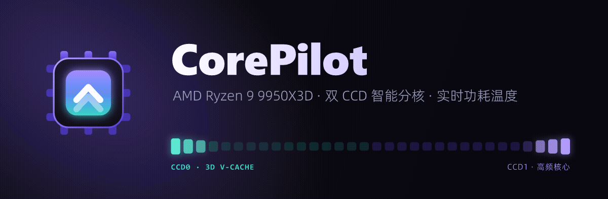
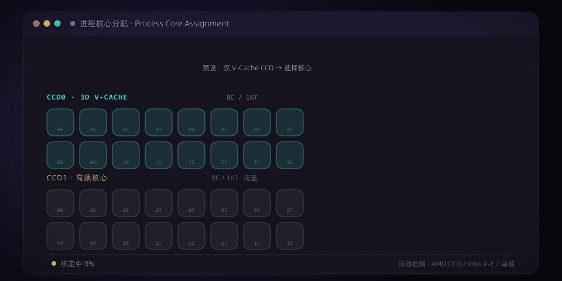
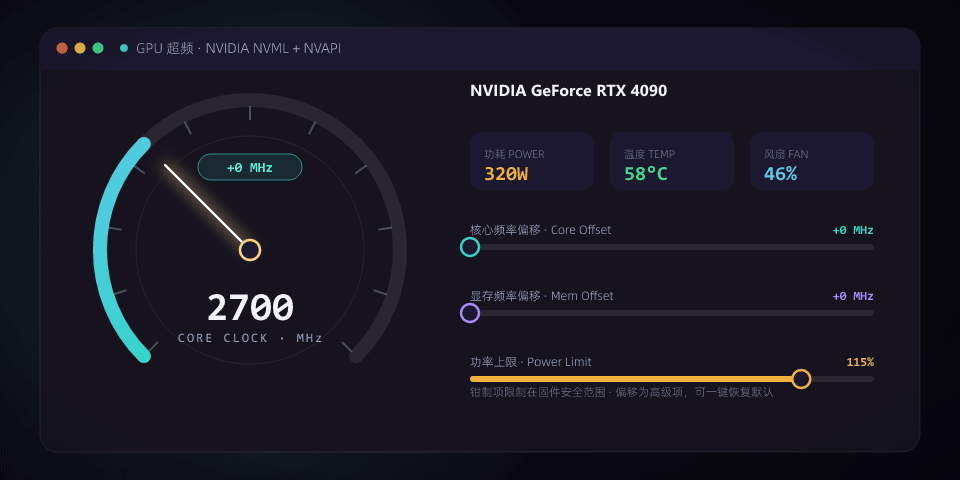
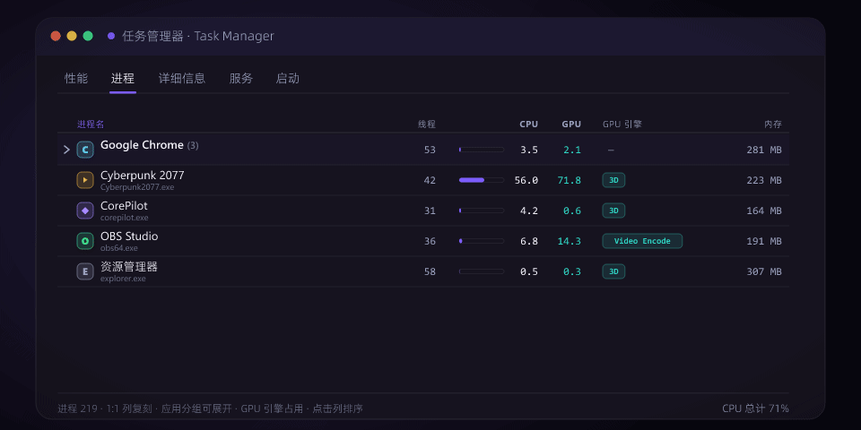
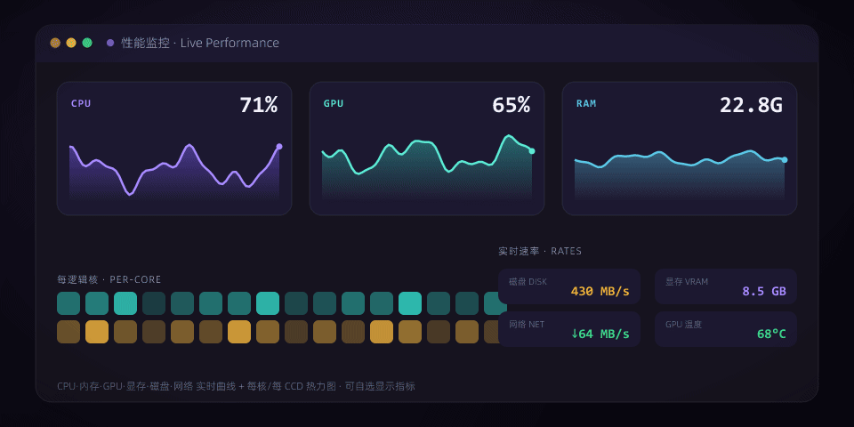
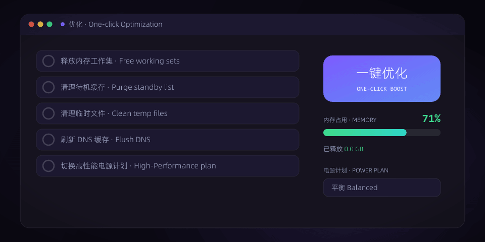
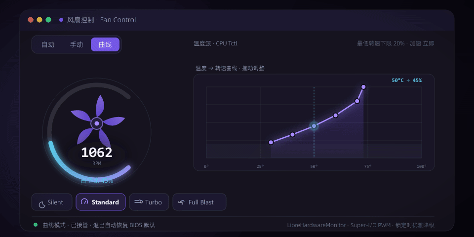

<!-- CorePilot README — visual showcase.
     Brand art is generated from SVG via branding/*.mjs (resvg → ffmpeg GIF).
     Regenerate with: node branding/<script>.mjs  (see branding/lib.mjs). -->

<p align="center">
  
</p>

<h1 align="center">CorePilot</h1>

<p align="center">
  <b>面向现代 Windows 11 PC 的高端性能优化软件 — 自动适配 AMD / Intel CPU 与各家 GPU</b>
</p>

<p align="center">
  A premium Windows 11 performance app — <b>topology-aware process core-assignment</b>
  (AMD CCD / 3D V-Cache <i>and</i> Intel P/E hybrids, HEDT up to 64 threads),
  <b>GPU overclocking</b> (NVML + NVAPI), a full <b>Task Manager</b> clone, live
  <b>monitoring</b>, one-click <b>optimization</b>, an in-game <b>OSD overlay</b>, a
  SpaceSniffer-style <b>disk-space treemap</b> (NTFS <code>$MFT</code> fast scan), and
  experimental AMD <b>SMU tuning</b> (Curve Optimizer / PBO).<br>
  Tuned on a Ryzen 9 9950X3D + RTX 4090 — it auto-detects and adapts to whatever it runs on.
</p>

<p align="center">
  
  
  
  
  
  
  
</p>

<p align="center">
  <sub><b>拓扑感知 Topology-aware</b> · <b>AMD / Intel</b> · <b>NVIDIA NVML + NVAPI</b> · <b>实时监控 Live monitoring</b> · <b>游戏内 OSD In-game overlay</b> · <b>存储分析 Disk treemap</b></sub>
</p>

---

## ✨ 概览 At a glance

| | |
|---|---|
| 🧠 **拓扑感知分核** | 自动识别 AMD 多 CCD / 3D V-Cache、Intel P/E 混合架构，把进程绑定到最合适的核心 |
| 🎛️ **GPU 超频** | NVIDIA NVML + NVAPI 真实 +/- MHz 频率偏移、功率/温度/风扇钳制 |
| 📊 **任务管理器复刻** | 性能 / 进程 / 详细信息 / 服务 / 启动，1:1 列复刻 + GPU 引擎占用 |
| 📈 **实时监控** | CPU / GPU / 内存 / 显存 / 磁盘 / 网络曲线 + 每核·每 CCD 热力图 |
| ⚡ **一键优化** | 释放内存、清待机缓存、清临时文件、刷新 DNS、高性能电源计划 |
| 🌀 **风扇控制** | 主板风扇调速（FanXpert 式）— 手动 / 温度曲线，基于 LibreHardwareMonitor，固件锁定时优雅降级 |
| 🎮 **游戏内 OSD** | 透明、点击穿透的叠加层 + 实时预览 + `Ctrl+Shift+F10` 热键 |
| 💾 **存储空间分析** | SpaceSniffer 式全盘 treemap — NTFS `$MFT` 极速扫描（数 TB 的 C: 约 15 秒）、扫描即填充动画、按区域配色、单击原地展开 |
| 🎚️ **SMU 精调（实验）** | AMD Curve Optimizer / PBO 偏移 + 深度传感器，PawnIO ring-0 净室实现，实验开关 + 自动回滚 |

---

<p align="center">
  
</p>

<p align="center">
  <sub><b>实机录制 · The app in motion</b> — 核心分配 → GPU → 风扇 → 优化 → 存储空间分析</sub>
</p>

---

## 🧠 ① 进程核心分配 · Topology-aware core assignment

<p align="center">
  
</p>

受《游戏++》启发的 CPU 亲和性管理器，**自动适配你的 CPU 拓扑**（无需手动配置）：

- **自动检测核心拓扑** — AMD 多 CCD / 3D V-Cache、Intel 性能核 (P) / 能效核 (E) 混合架构、或单一核心组，经 `GetLogicalProcessorInformationEx` + Windows 效能等级 (EfficiencyClass) 识别
- 列出所有运行进程：**进程名 / 硬件线程 / CPU / GPU / 内存 / 功耗**，全部支持点击排序、搜索、多选、全选
- 创建进程分组，为每组选择可运行的 **核心 / 线程 (C/T)** — 自适应逻辑核网格，按硬件给出 *仅 V-Cache / 仅 P 核 / 仅此组 / 全核* 等预设，**每组可自定义颜色**
- “硬件线程” 列按进程当前亲和性显示其线程数与所跨核心组（**V-Cache / 频率 CCD / 性能核 / 能效核 / CCD N**，随硬件自适应标注，绝不在非 X3D / Intel 机器上误标）
- 分组规则本地持久化（“记忆”）、支持导入 / 导出方案；运行时自动把新匹配的进程绑定到分组亲和性
- 右键菜单：加入分组 / 应用 / 移出 / 结束 / 复制；一键 **停用优化** 总开关

---

## 🎛️ ② GPU 超频 · GPU overclocking

<p align="center">
  
</p>

基于 **NVIDIA NVML + NVAPI** 的实时显卡调优，类 MSI Afterburner（NVIDIA 独显；其他品牌可监控但不超频）：

- 实时读数：核心 / 显存频率、温度、功耗（当前 / 上限）、GPU 占用、风扇、显存
- **功率上限**、**温度目标**、**风扇转速**（钳制在固件安全范围）+ **核心 / 显存频率偏移**（NVAPI，即 Afterburner 式 **+/- MHz 真实超频**，提升 Boost 上限）
- **超频配置保存** — 命名保存 / 一键切换 / 删除，可设 “启动时自动应用”
- 安全：钳制类项目限制在安全范围，频率偏移为可选高级项（建议小幅递增测试稳定性），随时一键 **恢复出厂默认**

---

## 📊 ③ 任务管理器 · Task Manager （1:1 复刻）

<p align="center">
  
</p>

保留 CorePilot 风格的二级标签页：

- **进程** — 可排序进程表，应用分组可展开（如 Google Chrome）+ GPU 占用 / GPU 引擎列（3D / Video Encode / Video Decode…）+ 一键结束任务
- **详细信息** — 名称 / PID / 用户 / CPU / CPU 时间 / 内存 / 句柄 / 线程 / 平台
- **服务 · 启动** — 1:1 列复刻；服务与启动项可按 “已启动优先” 排序、启停 / 禁用
- **性能** — 见下方 ④「实时监控」

> 上图为进程页：应用分组展开、每行 CPU 迷你条（>60% 转琥珀）、GPU 引擎徽章、点击列排序、悬停结束任务。

---

## 📈 ④ 实时监控 · Live monitoring

<p align="center">
  
</p>

- CPU / 内存 / GPU / 显存 / 磁盘 / 网络实时曲线 + 每逻辑核·每 CCD 热力图，**可自选显示哪些指标**
- 大号读数 + 曲线，磁盘 / 网络实时速率

> 上图为实时监控仪表盘：CPU / GPU / 内存大号读数 + 曲线，磁盘 / 网络速率，以及每核负载热力图（CCD0 V-Cache 青 · CCD1 高频 琥珀）。

---

## ⚡ ⑤ 一键优化 · One-click optimization

<p align="center">
  
</p>

- 释放内存（清空工作集）、清理 standby 缓存、清理临时文件、刷新 DNS
- 电源计划切换（平衡 / 高性能）
- **一键优化** — 以上全部 + 高性能电源计划，一键完成

---

## 🌀 ⑥ 风扇控制 · Fan control （FanXpert 式）

<p align="center">
  
</p>

主板风扇调速，**自动 / 手动 / 温度曲线** 三种模式，基于 LibreHardwareMonitor 读取 Super-I/O（Nuvoton / ITE / Fintek）转速并写入 PWM：

- **径向转速表** + 实时 RPM / 占空比读数；**温度 → 转速曲线** 可拖动调整（双击空白加点、双击点删除），曲线上的实时工作点随温度移动
- 内置预设 **Silent / Standard / Turbo / Full Blast**；可选温度源、最低转速下限（默认 20%，避免 AIO 水泵 / CPU 散热器停转）
- **依赖主板固件是否开放写入** —— 锁定的消费级主板（如部分 B850）只能读取转速、不能调速，界面会明确提示「主板已锁定」（优雅降级，绝不伪造）
- CorePilot 退出时自动把接管的风扇恢复为 BIOS 默认

> 上图为曲线模式：径向转速表内风扇随转速旋转、外环占空比弧，温度 → 转速曲线上的青色工作点随温度实时移动。

---

## 🎮 ⑦ 游戏内 OSD · In-game overlay

<p align="center">
  
</p>

透明、**点击穿透** 的游戏叠加层，由 CorePilot 现有的传感器 / NVML 数据驱动，低占用：

- **样式**：横向 / 竖排，简洁 / 丰富密度；圆角、不透明度、屏幕角落定位、OLED 防烧屏位移
- **内容**：CPU / GPU / 内存 / 磁盘 / 网络的占用、温度、功耗、频率、风扇、显存…（按硬件可用性优雅降级为 “—”）
- **配置面板内置实时预览**，所见即所得
- **全局热键** `Ctrl+Shift+F10` 一键开关，无需离开全屏 / 无边框游戏
- **FPS / 帧时间** 经 Intel **PresentMon**（ETW present 计时）— 已接入帧率，帧时间 / 延迟等逐步补齐

---

## 💾 ⑧ 存储空间分析 · Disk Space Analyzer

<p align="center">
  
</p>

SpaceSniffer 式的全盘 treemap 概览，**直接读取 NTFS `$MFT`** 而非逐目录遍历：

- **极速扫描** — 解析 `$MFT` 记录（含 `$ATTRIBUTE_LIST` 扩展记录、运行列表、USA fixup），数 TB 的 C: 盘约 15 秒扫完（比逐目录遍历快约 **18×**）；提权 + NTFS 时默认启用，否则回退到目录遍历
- **扫描即填充动画** — 每扫出一个文件夹就即时出现、其余方块跟着重新布局，从第一个文件夹到扫描结束全程平滑缓动（临界阻尼补间）
- **最大优先切片** — 节点预算按 alloc 大小「最大优先」分配，大文件夹被嵌套小块填满，而非塌成一个巨块
- **按区域配色** — 每个顶层区域（Users / Windows / Program Files…）一种色相、整片一致，按嵌套深度微调明度；扁平现代、细发丝分隔线
- **单击原地展开** — 点击文件夹不缩放，就地把巨块细分为其内容；面包屑下钻、占用 / 逻辑大小双指标、密度 LOD 滑杆、右侧最大项榜单 + 一键打开位置

> 上图为实机录制：C: 盘从空白到填满的扫描动画 —— treemap 随 `$MFT` 流式数据逐步出现并重新布局。

---

## 🖥️ 硬件适配 · Hardware support

CorePilot 自动适配运行它的硬件，无需手动配置：

| 部件 | 支持范围 |
|------|----------|
| **CPU** | AMD 多 CCD / 3D V-Cache（如 9950X3D）、Intel 性能核 / 能效核混合架构（12–14 代 / Core Ultra）、单 CCD Ryzen、同构 Intel —— 拓扑与核心类型自动识别并相应标注 |
| **GPU** | NVIDIA 独显：完整监控 + NVML / NVAPI 超频；AMD / Intel / 核显：监控（占用 / 显存 / 温度，经 PDH · DXGI · LibreHardwareMonitor），超频面板提示 “不支持” |
| **传感器** | 有 LibreHardwareMonitor sidecar 时提供 CPU / 主板功耗与温度；GPU 温度 / 功耗优先取 NVML（与 nvidia-smi 一致），任何缺失的数据优雅降级为 “—” 而非伪造 |

> 在非 X3D / Intel / 单簇 CPU 上不会再误标 “V-Cache / 频率 CCD”；GPU 温度在监控页与超频页一致（均取 NVML 核心温度，而非 sidecar 的热点温度）。

---

## 🚀 运行 · Running

应用需要 **管理员权限**（设置进程亲和性、GPU 调优、清理 standby list 等）。发行版 exe 已内置清单，会自动请求 UAC 提权。

```powershell
# 开发模式
npm install
npm run tauri dev

# 构建发行版
npm run tauri build
# 安装版 (installable): src-tauri/target/release/bundle/nsis/CorePilot_<ver>_x64-setup.exe
# 便携版 (portable):    corepilot.exe + sensord.exe + corepilot_overlay.dll 同放一个文件夹即免安装运行
#                       （三者均在 src-tauri/target/release/ 下）
```

> 发行附带 **安装版**（NSIS 安装包）与 **便携版**（免安装 zip）两种。Releases 页可直接下载。

环境要求：Windows 10/11、Node ≥ 18、Rust (stable-msvc)、MSVC Build Tools、WebView2 Runtime、.NET 8（传感器 sidecar）。

---

## 🧩 技术栈 · Tech stack

| 层 | 技术 |
|----|------|
| **后端** | Rust + Tauri 2，`windows` (windows-rs) 直接调用 Win32 — 亲和性 (`SetProcessAffinityMask`)、拓扑 (`GetLogicalProcessorInformationEx` + EfficiencyClass，识别 AMD CCD / Intel P-E)、PDH 性能计数器、DXGI、`NtSetSystemInformation` 内存命令、SCM 服务枚举 |
| **GPU 调优** | `nvml-wrapper` (NVML) — 功率上限 / 温度目标 / 风扇 + 实时读数；`nvapi` — 核心 / 显存 +/- MHz 频率偏移（Afterburner 式真实超频） |
| **OSD / FPS** | Tauri `WebviewWindowBuilder` 透明点击穿透叠加窗 + 全局热键；Intel **PresentMon**（ETW present 计时）提供帧率 |
| **传感器** | LibreHardwareMonitor (.NET 8 sidecar) 提供 CPU / 主板功耗与温度；GPU 温度 / 功耗优先取 NVML；PDH (GPU/磁盘) + DXGI (显存) + sysinfo (网络/进程) |
| **前端** | React 19 + TypeScript + Vite + Tailwind v4 + Motion (动画) + zustand (自动持久化) |

---

## 🔧 诚实的局限 · Known limitations

- **GPU 超频** — 功率 / 温度 / 风扇通过 NVML 钳制在固件安全范围；核心 / 显存 `+/- MHz` 频率偏移通过 **NVAPI**（Afterburner 式真实超频，偏移过高可能花屏，请小幅测试）。仅 **NVIDIA** 独显支持超频；AMD / Intel 显卡可监控但不可超频。
- **游戏内 OSD** — 硬件指标（CPU / GPU / 内存 / 温度 / 功耗 / 频率…）的低占用叠加层已可用，含 `Ctrl+Shift+F10` 全局热键与实时预览；**FPS** 经 PresentMon 接入，**帧时间 / 延迟** 等逐项补齐中。
- **主板风扇控制（风扇页）** — 已内置 FanXpert 式调速：经 LibreHardwareMonitor 读取 Super-I/O（Nuvoton / ITE / Fintek）风扇转速并写入 PWM，支持手动转速与温度曲线（可选温度源、最低转速下限）。**依赖主板固件是否开放写入** —— 许多锁定的消费级主板（如部分 B850）不允许软件写入，此时可读取转速但不能调速，界面会明确提示「主板已锁定」（优雅降级，不会伪造）。CorePilot 退出时自动把接管的风扇恢复为 BIOS 默认。「自动调谐」（物理扫描每个风扇的转速区间）尚未加入。
- **超大核心数 CPU** — 前端亲和性掩码当前用 JS number（双精度），逻辑核 > 53 的平台（Threadripper / EPYC / 双路）核心分配可能不精确；后端 (u64) 正确。计划改用 BigInt。
- **亚克力模糊** — 按要求暂时关闭，后续将作为可选项重新加入。

---

<p align="center">
  
</p>

<p align="center">
  <sub>详细规划见 <a href="docs/planning/"><code>docs/planning/</code></a> · 构建进度见 <a href="PROGRESS.md"><code>PROGRESS.md</code></a><br>
  README 动画由 <code>branding/*.mjs</code> 生成（SVG → <code>@resvg/resvg-js</code> → <code>ffmpeg</code> GIF），重新生成： <code>node branding/&lt;script&gt;.mjs</code></sub>
</p>
